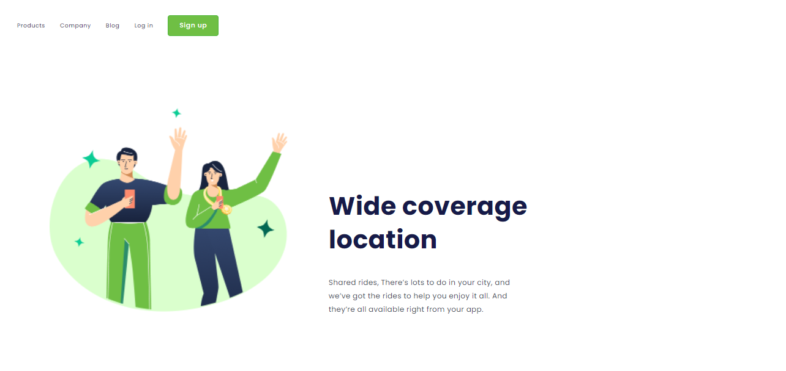

# Site responsivo
 

> Resultado do projeto!

### Linguanges usadas no Projeto:

- [x] HTML
- [x] CSS

## Desenvolvido por:

<table>
  <tr>
    <td align="center">
      <a href="#">
         
        
          <b>Fernando Freitas</b>
        
      </a>
    </td>
   </tr>
</table>
